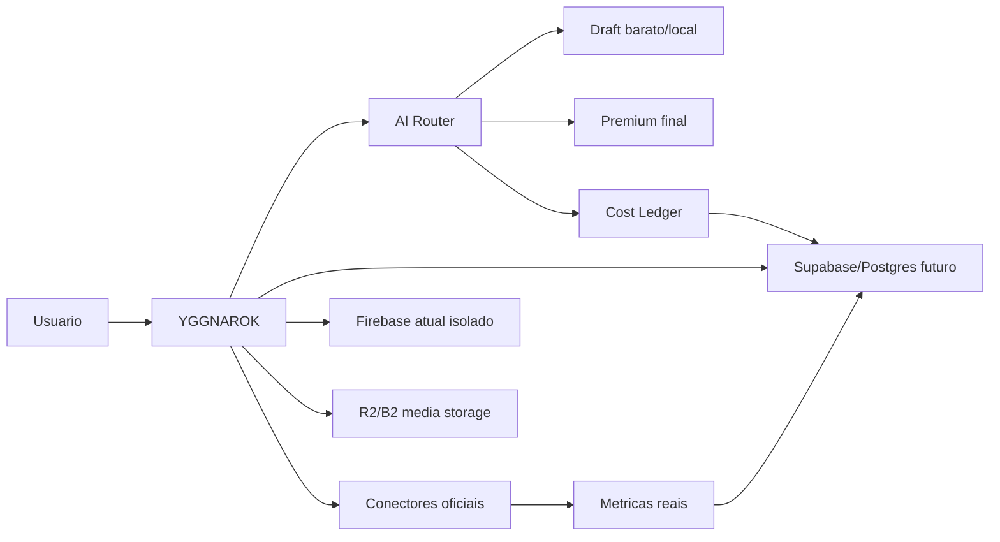

# YGGNAROK - Base de Infra, IA e Dados

Data da pesquisa: 2026-05-18

Este documento define a base para o YGGNAROK sair de uma dependencia rigida do Firebase e virar um sistema privado com backend mais portavel, armazenamento barato para midias, roteador de IA por tarefa/custo/qualidade, ledger de gasto e coleta de dados reais por APIs oficiais.

## Decisao principal

Minha recomendacao para o OS e uma arquitetura hibrida:

1. **Agora:** manter Firebase vivo somente onde ele ja funciona.
2. **Base nova:** preparar Supabase/Postgres para usuarios, perfis, jobs, metricas, ledger de IA e historico.
3. **Midia pesada:** mover imagens, videos e audios gerados para Cloudflare R2 ou Backblaze B2, nao para o banco principal.
4. **Arquivo pessoal:** usar Google Drive apenas como backup/export/arquivo, nao como storage operacional do app.
5. **IA:** nunca depender de um unico modelo. O OS escolhe o provedor pela tarefa.
6. **Dados reais:** usar OAuth/API oficial/export oficial. Evitar scraping como fonte principal.

## Firebase: sair ou manter?

Firebase ainda e bom para prototipo, login rapido e apps pequenos. O problema e que, quando o OS comeca a gerar e sincronizar muita coisa, voce precisa de previsibilidade, tabelas relacionais, auditoria e custo controlado.

O ideal nao e fazer uma troca brusca agora. Primeiro isolamos o Firebase em services, depois criamos Supabase/Postgres para dados novos, e so entao migramos auth/perfis quando tudo estiver validado com backup e permissoes.

| Opcao | Uso ideal | Opiniao |
| --- | --- | --- |
| Firebase | Prototipo, dados legados e estrutura temporaria | Bom para manter onde ja existe, mas nao deve ser o nucleo final |
| Supabase | Auth + Postgres + dados relacionais | Melhor destino principal para o OS |
| Appwrite | Backend open-source completo | Bom candidato se voce quiser sair do ecossistema Google/Supabase |
| PocketBase | Uso privado pequeno e barato | Otimo laboratorio, mas exige cuidado para escala/backup |
| Directus | Painel editorial/admin sobre SQL | Bom como camada de admin/CMS, nao como unico backend |
| Postgres custom | Controle total | Melhor no futuro, quando o OS estiver maduro |

Fontes: Firebase pricing https://firebase.google.com/pricing, Supabase pricing https://supabase.com/pricing, Appwrite pricing https://appwrite.io/pricing, PocketBase production https://pocketbase.io/docs/going-to-production/, Directus pricing https://directus.io/pricing/.

## Storage e midia pesada

Banco de dados guarda metadados. Objeto grande vai para object storage.

| Opcao | Melhor uso | Opiniao |
| --- | --- | --- |
| Cloudflare R2 | Midia operacional servida pelo app | Melhor primeira escolha, S3 compativel e sem egress direto |
| Backblaze B2 | Backup, arquivo frio, datasets | Forte para custo de storage e arquivo |
| Wasabi | Biblioteca grande por TB | Bom se voce quiser previsibilidade, mas conferir minimos/retencao |
| Supabase Storage | Assets de app e imagens leves | Bom junto do Supabase, nao para virar deposito gigante de video |
| Google Drive | Backup/export pessoal | Aproveita seus 5TB enquanto durar, mas nao e storage operacional |
| MinIO | S3 self-hosted | So quando voce aceitar cuidar de servidor, backup e redundancia |

Minha opiniao: comece com **R2 para midia operacional** e **Backblaze B2 ou Drive para arquivo frio**. Assim voce nao fica preso e nao transforma Firebase/Supabase em deposito de video.

Fontes: Cloudflare R2 pricing https://developers.cloudflare.com/r2/pricing/, Backblaze B2 pricing https://www.backblaze.com/cloud-storage/pricing, Wasabi pricing https://wasabi.com/pricing, MinIO https://min.io/.

## Camada de IA do OS

O OS nao deve perguntar "qual IA eu uso?". Ele deve perguntar:

- qual e a tarefa?
- precisa ser barato ou premium?
- e rascunho ou resultado final?
- tem risco de direitos autorais?
- tem teto de gasto?
- precisa de velocidade?
- precisa de multimodalidade?

Por isso foi criada a base em:

- `src/services/ai/types.ts`
- `src/services/ai/providerRegistry.ts`
- `src/services/ai/aiRouter.ts`
- `src/services/ai/costLedger.ts`

Fluxo ideal:

1. Usuario pede conteudo.
2. OS classifica a tarefa.
3. Roteador escolhe provedor barato/local para rascunho.
4. Agente revisa risco, qualidade e direitos.
5. So o melhor prompt vai para geracao cara.
6. Ledger registra custo previsto e custo real.
7. Resultado e salvo com modelo, prompt, custo, versao, perfil e plataforma.

| Provedor | Melhor uso |
| --- | --- |
| Gemini | Estrategia, multimodal, rascunhos e ecossistema Google |
| Veo | Video final premium |
| OpenAI | Agentes, raciocinio, imagem, audio, revisao |
| Anthropic/Claude | Revisao profunda, escrita, risco, estrategia |
| Runway | Video criativo e previews |
| ElevenLabs | Voz final premium |
| Deepgram | Transcricao, legendas, audio utilitario |
| Replicate | Laboratorio de modelos open-source |
| fal.ai | Laboratorio rapido de imagem/video |
| OpenRouter | Agregador/fallback de LLMs |
| Together/Groq/Mistral | Drafts, classificacao, baixo custo, latencia |
| Local/Ollama | Rascunhos privados e embeddings sem custo por token |

Minha opiniao sobre audio: **ElevenLabs fica como voz final**, nao como ferramenta de tentativa e erro. Para rascunho, legenda, transcricao e testes, usar Deepgram, OpenAI TTS/STT, modelos locais ou alternativas via Replicate/fal quando fizer sentido.

Fontes: Gemini API pricing https://ai.google.dev/gemini-api/docs/pricing, OpenAI API pricing https://openai.com/api/pricing/, Anthropic pricing https://docs.anthropic.com/en/docs/about-claude/pricing, Runway API pricing https://docs.dev.runwayml.com/guides/pricing, ElevenLabs API pricing https://elevenlabs.io/pricing/api/, Deepgram pricing https://deepgram.com/pricing, Replicate pricing https://replicate.com/pricing, fal.ai pricing https://docs.fal.ai/documentation/model-apis/pricing, OpenRouter pricing https://openrouter.ai/pricing.

## Dados reais das plataformas

Cada conteudo gerado pelo OS precisa carregar um ID interno. Quando for publicado, o OS salva plataforma, URL, ID externo, perfil, campanha, UTM/subid, IA/modelo que ajudou, custo de producao, custo de anuncio e metricas reais importadas.

| Plataforma | Fonte confiavel |
| --- | --- |
| YouTube | YouTube Data API + YouTube Analytics quando necessario |
| Instagram | Instagram Graph API / Meta |
| TikTok | TikTok Display API e, depois, Business API se houver ads |
| Site/landing page | Google Analytics Data API |
| SEO | Search Console API |
| Meta Ads | Meta Marketing API |
| TikTok Ads | TikTok Business API |
| Afiliados | API da rede ou CSV oficial com UTM/subid |

Regra de ouro: o dado precisa vir de fonte auditavel. Para afiliacao, UTM/subid e obrigatorio se voce quer saber qual conteudo gerou dinheiro.

Fontes: YouTube Data API https://developers.google.com/youtube/v3/getting-started, Instagram Platform https://developers.facebook.com/docs/instagram-platform/, TikTok Display API https://developers.tiktok.com/doc/display-api-overview, Google Analytics Data API https://developers.google.com/analytics/devguides/reporting/, Search Console API https://developers.google.com/webmaster-tools, Meta Marketing API https://developers.facebook.com/docs/marketing-apis/, TikTok Business API https://ads.tiktok.com/marketing_api/docs.

## Cortes de custo sem limitar o OS

O jeito de cortar custo nao e escolher a IA mais barata sempre. E criar uma esteira:

1. Ideia e briefing: modelo barato/local.
2. Roteiro: Gemini/OpenAI barato ou open model.
3. Critica e melhoria: modelo melhor, mas ainda texto.
4. Geracao visual barata: Replicate/fal/Runway draft.
5. Aprovacao humana: antes de gastar com video/voz final.
6. Video premium: Veo/Runway so para a versao vencedora.
7. Voz premium: ElevenLabs so depois do script travado.
8. Analise: dados reais voltam para o OS e melhoram o proximo ciclo.

Guardrails obrigatorios:

- teto diario;
- teto mensal;
- teto por tarefa;
- confirmacao manual para video premium;
- log de custo previsto vs real;
- proibicao de loop infinito de agente;
- armazenamento do prompt e output para reaproveitar o que ja funcionou;
- revisao de direitos antes de publicar.

## Proximas implementacoes tecnicas

1. Criar tabelas futuras: `ai_jobs`, `ai_usage_records`, `platform_accounts`, `platform_metric_snapshots`, `media_assets`.
2. Criar backend server-side para esconder chaves de API.
3. Ligar `routeAiTask()` ao fluxo de criacao de conteudo.
4. Criar tela de "Orcamento de IA" no painel.
5. Criar importador CSV inicial para afiliados e plataformas.
6. Criar OAuth por plataforma somente depois que a base de dados estiver pronta.

